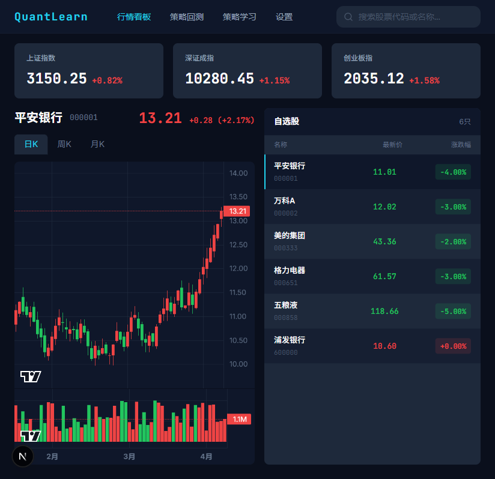
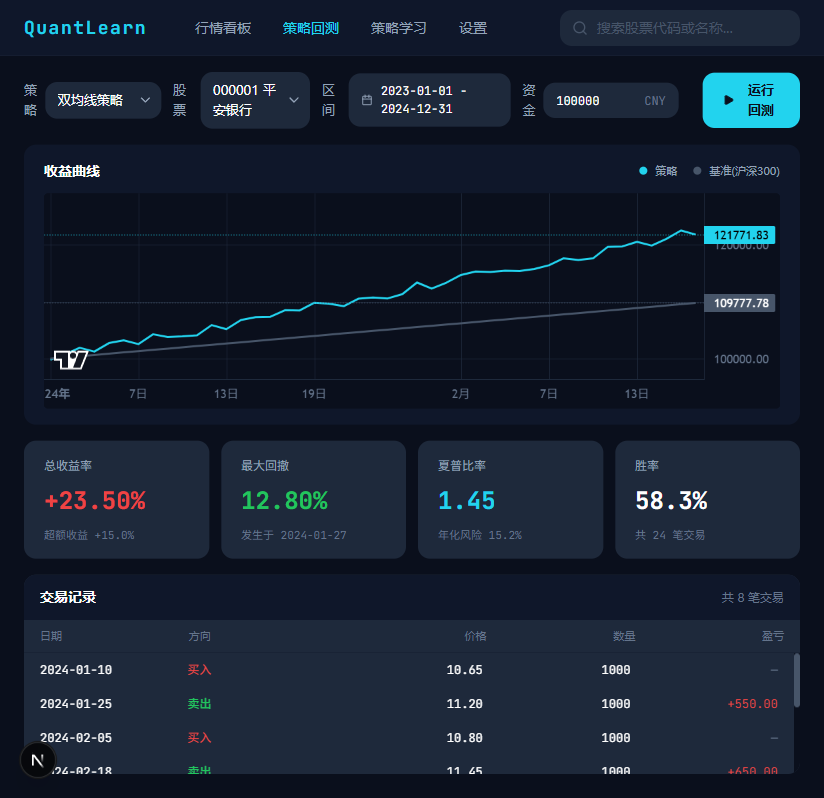
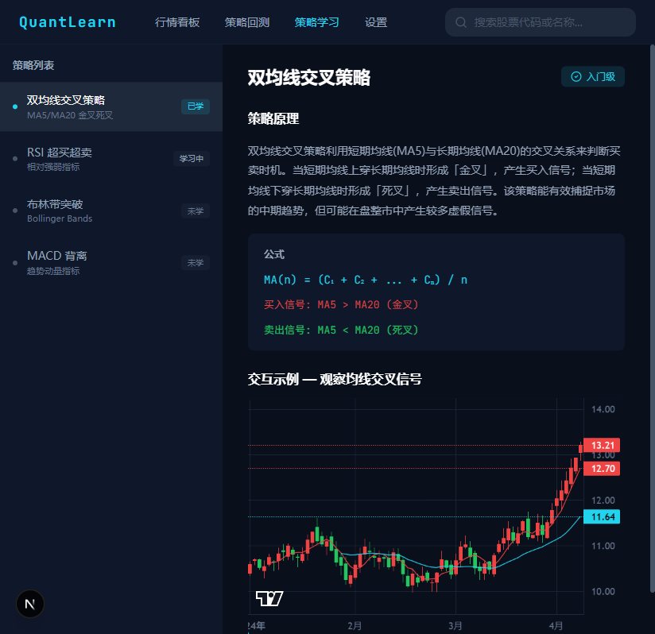

# 量化学习平台 (Quant Learn)

> 面向中国 A 股市场的量化交易学习平台。从数据获取、策略编写到回测验证，一站式学习量化投资。



## 功能概览

- **实时行情看板** — 上证/深证/创业板指数快照，自选股管理，K 线图展示
- **策略学习** — 4 种经典量化策略（双均线交叉、RSI、布林带、MACD），含原理讲解与参数说明
- **回测引擎** — 选定股票、策略、时间范围，一键回测并查看收益曲线与交易明细
- **数据缓存** — SQLite 本地缓存，避免重复请求，提升加载速度
- **自选股 & 设置** — 持久化用户偏好与关注列表

| 回测页面 | 学习页面 |
|----------|----------|
|  |  |

## 技术架构

```
┌─────────────────────┐     HTTP/JSON     ┌─────────────────────┐
│     Frontend         │ ◄──────────────► │      Backend         │
│  React 19 + Next.js  │    localhost:3001 │   Rust + axum        │
│  TypeScript (strict)  │                  │                      │
│  Tailwind CSS v4      │                  │  ┌────────────────┐  │
│  Lightweight Charts   │                  │  │ 东方财富 API    │  │
└─────────────────────┘                    │  └───────┬────────┘  │
                                           │          │           │
                                           │  ┌───────▼────────┐  │
                                           │  │  SQLite (WAL)   │  │
                                           │  │  本地缓存       │  │
                                           │  └────────────────┘  │
                                           └─────────────────────┘
```

### 前端

| 技术 | 用途 |
|------|------|
| React 19 | UI 框架 |
| Next.js 16 | 应用框架（App Router） |
| TypeScript (strict) | 类型安全 |
| Tailwind CSS v4 | 样式系统 |
| Lightweight Charts | K 线图、收益曲线 |
| Lucide React | 图标库 |
| Playwright | E2E 与视觉回归测试 |

### 后端

| 技术 | 用途 |
|------|------|
| Rust (edition 2024) | 后端语言 |
| axum 0.8 | HTTP 框架 |
| reqwest | HTTP 客户端（获取行情数据） |
| rusqlite (bundled) | 嵌入式 SQLite |
| tokio | 异步运行时 |
| tower-http | CORS、请求追踪中间件 |
| tracing | 结构化日志 |
| serde / serde_json | 序列化 |
| chrono | 日期时间处理 |

### 数据源

- **东方财富 HTTP API** — 股票日线 OHLCV、指数快照、股票搜索
- 无需 Python 依赖，Rust 直接调用
- 内置指数退避重试、超时保护、请求频率约束

## 快速开始

### 环境要求

- **Rust** — stable 工具链 ([安装](https://rustup.rs/))
- **Node.js** — 18+  ([安装](https://nodejs.org/))
- **Git**

### 一键启动

```bash
# 克隆项目
git clone <repo-url> quant-learn
cd quant-learn

# 启动后端 (端口 3001)
cd backend
cargo run &

# 启动前端 (端口 3000)
cd ../frontend
npm install
npm run dev
```

然后打开浏览器访问 **http://localhost:3000**

> **提示**：首次编译 Rust 后端约需 1-2 分钟，后续启动为秒级。

### Windows 用户

```powershell
# 终端 1 — 后端
cd backend
cargo run

# 终端 2 — 前端
cd frontend
npm install
npm run dev
```

## 项目结构

```
quant-learn/
├── frontend/                        # React + Next.js 前端
│   ├── src/
│   │   ├── app/                     # 页面路由
│   │   │   ├── dashboard/           # 行情看板
│   │   │   ├── backtest/            # 回测页面
│   │   │   ├── learn/               # 策略学习
│   │   │   └── settings/            # 用户设置
│   │   ├── components/              # UI 组件
│   │   │   ├── common/              # 通用组件 (Skeleton, Toast, EmptyState)
│   │   │   ├── dashboard/           # 看板组件 (K线图, 自选股, 指数快照)
│   │   │   ├── backtest/            # 回测组件 (配置栏, 指标卡片, 交易表)
│   │   │   ├── learn/               # 学习组件 (策略列表, 内容区)
│   │   │   └── settings/            # 设置组件
│   │   ├── services/api.ts          # 后端 API 调用层
│   │   ├── types/index.ts           # TypeScript 类型定义
│   │   ├── hooks/                   # 自定义 Hooks (useDebounce)
│   │   └── mocks/                   # 阶段一假数据 (已弃用)
│   ├── tests/
│   │   ├── e2e/                     # Playwright E2E 测试
│   │   └── visual/                  # 视觉回归测试
│   └── package.json
│
├── backend/                         # Rust + axum 后端
│   ├── src/
│   │   ├── main.rs                  # HTTP 服务入口 (端口 3001)
│   │   ├── routes.rs                # API 路由定义
│   │   ├── types.rs                 # 共享数据类型
│   │   ├── data/
│   │   │   ├── market_data.rs       # 东方财富 API 数据获取
│   │   │   └── cache.rs             # SQLite 缓存层 (WAL 模式)
│   │   ├── engine/
│   │   │   └── backtest.rs          # 回测引擎
│   │   ├── strategies/
│   │   │   ├── mod.rs               # 策略 trait + 学习内容
│   │   │   ├── ma_cross.rs          # 双均线交叉策略
│   │   │   ├── rsi.rs               # RSI 超买超卖策略
│   │   │   ├── bollinger.rs         # 布林带突破策略
│   │   │   └── macd.rs              # MACD 策略
│   │   └── bin/
│   │       └── test_data.rs         # 数据获取 CLI 工具
│   ├── tests/                       # 141 个集成测试
│   └── Cargo.toml
│
├── docs/
│   ├── api-contract.md              # API 接口契约文档
│   └── screenshots/                 # 页面截图
│
├── AGENTS.md                        # AI 协作约束
├── CLAUDE.md                        # 开发规范
└── quant-learn-dev-plan.md          # 开发计划
```

## API 概览

后端在 `http://localhost:3001/api` 提供以下接口：

| 方法 | 路径 | 说明 |
|------|------|------|
| GET | `/api/stock/daily?symbol=&start=&end=` | 股票日线数据 (OHLCV) |
| GET | `/api/stock/search?keyword=` | 股票搜索 |
| GET | `/api/index/snapshot` | 主要指数快照 |
| GET | `/api/strategies` | 策略列表 |
| GET | `/api/strategies/:id` | 策略详情 + 学习内容 |
| POST | `/api/backtest` | 执行回测 |
| GET | `/api/watchlist` | 获取自选股列表 |
| POST | `/api/watchlist` | 添加自选股 |
| DELETE | `/api/watchlist/:symbol` | 删除自选股 |
| GET | `/api/settings` | 获取用户设置 |
| PUT | `/api/settings` | 更新用户设置 |
| GET | `/api/strategies/:id/learn` | 策略学习内容 |

完整契约详见 [docs/api-contract.md](docs/api-contract.md)。

## 量化策略

平台内置 4 种经典量化策略：

| 策略 | 核心逻辑 | 默认参数 |
|------|----------|----------|
| **双均线交叉** | 短期均线上穿长期均线买入，下穿卖出 | 短期 5 日，长期 20 日 |
| **RSI** | RSI 低于超卖线买入，高于超买线卖出 | 周期 14，超卖 30，超买 70 |
| **布林带** | 价格跌破下轨买入，突破上轨卖出 | 周期 20，宽度 2.0 倍标准差 |
| **MACD** | MACD 线上穿信号线买入，下穿卖出 | 快线 12，慢线 26，信号线 9 |

每种策略均包含：
- 原理讲解与数学公式
- 可调参数说明
- 适用场景与风险提示

## 测试

```bash
# 后端单元/集成测试 (141 个)
cd backend
cargo test

# 前端 E2E 测试 (需要先启动前后端服务)
cd frontend
npx playwright test tests/e2e/

# 前端视觉回归测试
cd frontend
npx playwright test tests/visual/
```

## 开发

### 前端开发

```bash
cd frontend
npm run dev      # 开发服务器 (热重载)
npm run build    # 生产构建
npm run lint     # ESLint 检查
```

### 后端开发

```bash
cd backend
cargo run        # 启动服务
cargo test       # 运行测试
cargo clippy     # Lint 检查
cargo fmt        # 格式化
```

### 开发约束

- 前端组件通过 `services/api.ts` 调用后端，不直接依赖后端实现
- 前后端共享类型定义分别在 `frontend/src/types/` 和 `backend/src/types.rs`
- API 契约以 `docs/api-contract.md` 为准
- 中文注释（面向 A 股市场）

## 许可证

MIT
